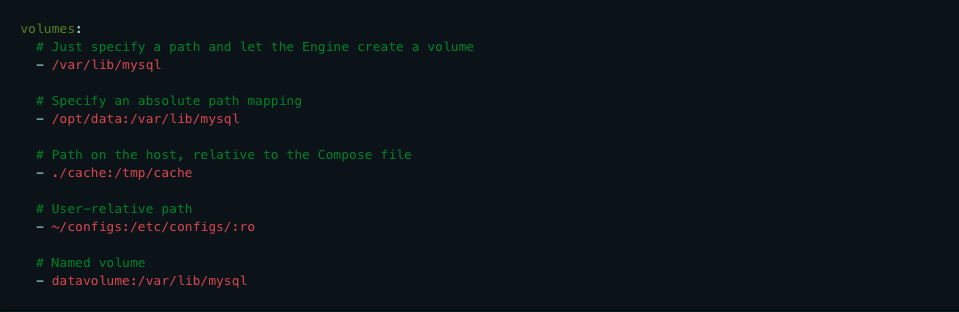

What I needed nodemon to do is detect changes in any of the Typescript files, then issue a command to recompile the files, then run the app.js file. Below is the way I was able to get that to work.

```
"nodemon -e ts --exec \"tsc && node ./dist/index.js\""
```

#### -e:

This specifies the file extension we want nodemon to watch out for. In this case it is files ending in .ts

#### --exec:

This will run a non node script so in this case what we are going to run is the following: **tsc && node ./dist/index.js**

###### tsc:

Looking at your tsconfig.json this will run typescript on all files in the src folder and then output them to the dist folder

###### node ./dist/index.js:

We will then run node on the newly updated index.js file located in the dist folder

---

## Bind Mounts & Volumes


Bind mounts have limited functionality compared to volumes. When you use a **bind mount**, a **file or directory on the host machine is mounted into a container**. The file or directory is referenced by its absolute path on the host machine. By contrast, when you use a **volume**, a **new directory is created within Docker’s storage directory on the host machine**, and Docker manages that directory’s contents.

The file or directory does not need to exist on the Docker host already. It is created on demand if it does not yet exist. Bind mounts are very performant, but they rely on the host machine’s filesystem having a specific directory structure available. If you are developing new Docker applications, consider using named volumes instead. You can’t use Docker CLI commands to directly manage bind mounts.

### volumes

Mount host paths or named volumes. Named volumes need to be specified with the top-level volumes key.

SHORT SYNTAX

The short syntax uses the generic [SOURCE:]TARGET[:MODE] format, where SOURCE can be either a host path or volume name. TARGET is the container path where the volume is mounted. Standard modes are ro for read-only and rw for read-write (default).

You can mount a relative path on the host, which expands relative to the directory of the Compose configuration file being used. Relative paths should always begin with . or ..


